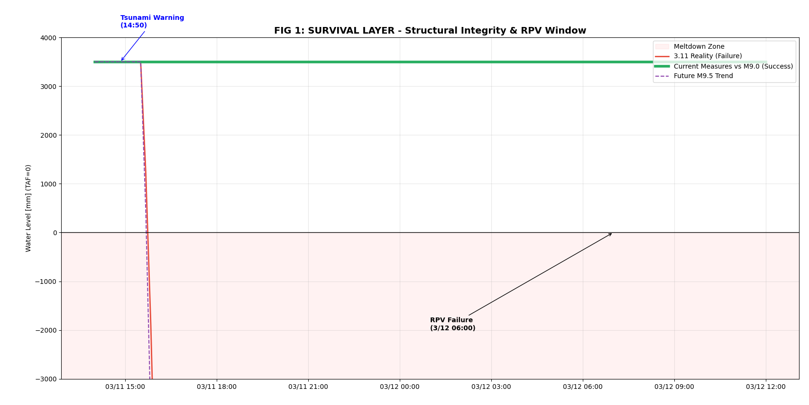
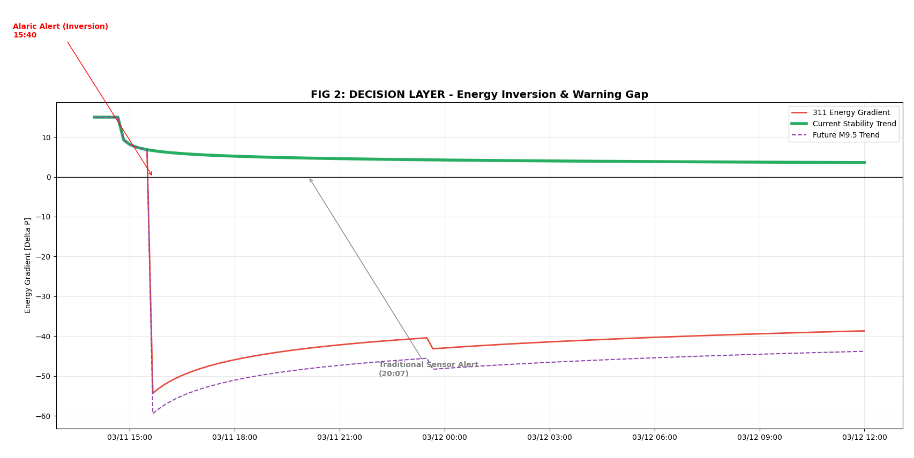
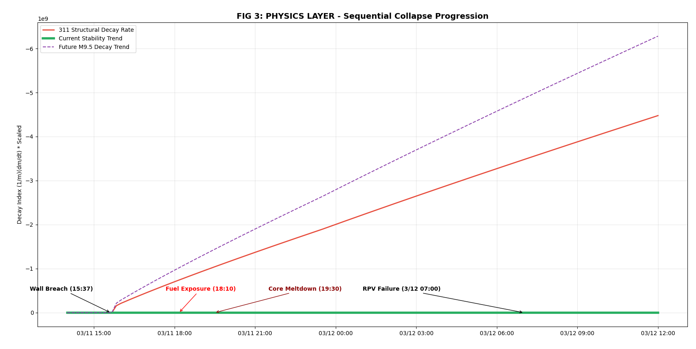

  <h1>🌀 RPG｜地殻変動と津波崩壊の事象地平判定プロトコル</h2>
  

    <i>── Fury of Gaia and Poseidon ──</i> 
    <i>Probability is for comfort. Dynamics is for survival.</i>
  

$$確率は気休めであり、動力学こそが生存である。$$

# 前言：確率論が動力学の前で無力化する時

従来の評価基準（ISO 31000等）は、リスクを「確率 × 影響」という静的なマトリックスに閉じ込めてきました。しかし、M9.0を超える極端な事象の前では、確率はもはや予測の意義を失います。津波が防潮堤を越えた瞬間、発生確率は100%となり、残されるのは残酷な物理的因果のみです。

本研究が提唱する **Resonance Power Gradient (RPG: 共鳴能勢梯度理論)** は、リスク評価を確率論から動力学へと押し進めることを目的としています。我々は事象が起こる確率はいくつかとは問いません。我々が問うのは、エネルギーバランスが傾いたその瞬間、システムの構造崩壊速度（dm/dt）はどれほど速いかという問いです。これは、物理AIを利用して現実世界に対して行われる外科手術的な解体作業です。

# 第一章：意味層 —— 相対論的な構造進化

本章では、Resonance Power Gradient (RPG: 共鳴能勢梯度理論 [DOI: [https://doi.org/10.13140/RG.2.2.13197.60649](https://doi.org/10.13140/RG.2.2.13197.60649)]) を引用し、まずその理論を直接解剖することから始める。これはアインシュタインの質能等価性公式をリスク学の観点から深く書き換えたものであり、システムの保存量バランスを定義する。

$$m = \frac{1}{c^2}(P \cdot \zeta + E \cdot \frac{d\zeta}{dt})$$

【パラメータの意義と直感的理解】

* m (Structural Mass)：構造的質量。これは物理的な重量ではなく、防御残量を意味します。システムの生存のための予算と考えることができます。
* P (Active Power)：能動的防御出力。冷却システムや補水ポンプなど、システムがエントロピー増大（發熱）に対抗するための能動的な手段です。
* zeta (Structural Integrity)：構造的整合性指標。本ケースでは原子炉水位を指します。
* E (External Impact)：外部衝撃エネルギー。津波が衝突する際の運動エネルギーポテンシャルを表します。
* d_zeta_dt (Decay Rate)：構造の時間的な崩壊率（変化の速度）です。

【意味層の真理：エネルギー保存則による処刑】

システムの各要素間の相関性を説明している。全交流電源喪失（SBO）が発生した時、P（冷却出力）はゼロになる。物理的な等式のバランスを維持するために、システムは構造的整合性の崩壊速度（水位の急落）を激化させることで、持続する外部衝撃エネルギー E を相殺せざるを得ない。崩壊は偶然ではなく、極限の圧力下でエネルギーバランスを強制的に維持しようとする物理法則が、システムに支払わせる生存の利息である。これが病状を観察する診断の段階である。

# 第二章：記述層 —— Alaric Resonance Law

記述層においては、Alaric Resonance Law を適用し、システムが定常状態から崩壊へと向かう物理的原型である相対的崩壊速度を定義する。

$$\frac{1}{m} \frac{dm}{dt} = \frac{\hat{a} \cdot \hat{v}}{c^2}$$

【記述層の論理構築】

* 1/m * dm/dt (Collapse Rate)：防御残量が消失するパーセンテージ速度を表します。これはシステム崩壊の傾きを描写します。
* a-hat (エントロピー増大/熱能項)：システム内部の無秩序度（原子炉の崩壊熱など）を表します。
* v-hat (運動量/衝撃項)：外部からの破壊力（堤防を越える津波の動能など）を表します。
* c^2 (構造的剛性)：システム防御の硬度です。

【魂：破壊的共振 (Destructive Resonance)】

この公式は、なぜ災厄が加速的に進行するのかを説明している。内部の熱（エントロピー）と外部の力（運動量）が、分母である剛性が不足している状況下で出会うと、両者は加算ではなく乗算の効果を生み出す。これこそが破壊的共振であり、内外のエネルギーが結合した時、システムの構造はガラスのように一瞬で砕け散る。

# 第三章：演算層 —— Alaric Term（アラリック項）の具象化

記述層から演算層へと入る時、物理法則を感知可能なモニタリング指標へと転換する必要がある。これがコードにおける Alaric Term の由来であり、システムが事象の地平面（Event Horizon）へと向かうレートを実体化する。

3.1 演算轉換論理

実装において、記述層の変化率を正規化されたモニタリング指標へと転換する。

$$\text{Alaric Term} \propto \frac{\text{Internal Decay} + \text{Structural Collapse}}{\text{Current Integrity}}$$

3.2 具象化：死の時間の予測

* 分子（應力総和）：内部の崩壊熱 ＋ 外部動能衝撃の非線形結合。
* 分母（残存能力）：現在の整合性指標（コード内の current_mass）。

診断から予測へ：第二巻の記述層は崩壊の傾向を示すが、演算層の Alaric Term は現在の臓器不全の速度に基づき、あと何分で脳死に至るかを精密に計算する。この指標が急上昇した時、水位計がまだ残っていたとしても、物理的な論理においてそのシステムは不可逆的な事象の地平面を超えたことを意味する。

# 第四章：デジタルツインの実装 —— Pythonにおける校正ノブ假說

物理公式をコードに変換するために、二つの重要な校正ノブ（Calibration Knobs）を導入した。本研究がこれらのパラメータを公開するのは、反証可能性を備えた技術的基準を確立するためである。

1. 1.6乗の觸媒効果 —— 外部衝撃の非線形性

Python

term_v = (self.v ** 1.6) * 4.5

物理假說：理想的な v の二乗ではなく、あえて 1.6乗を採用している。堤防を越えた津波は純粋な運動エネルギーではなく、泥沙や瓦礫、破断した配管などが混じり合った混迷した應力となる。これが、3.11の悪化速度が従来のモデル予測よりも残酷であった理由を説明する。

2. 物理結合項 (Coupling) —— 内外の共振

Python

coupling = (term_a * term_v) * 0.02
d_zeta_dt -= (term_a + term_v + coupling) * dt_min

物理実装：内部の発熱と外部の衝撃は単なる加算ではなく、共振を引き起こす。この 0.02 という重みは、配管破断によって注水不能となった後の残酷な結合を実体化したものである。これらの係数に対する修正案は、エネルギー結合と非線形な衝撃拡大を認める動力学の枠組みの上に構築されなければならない。これこそが、リスク管理をデータフィッティングから物理の本質へと回帰させる鍵となる戦場である。

# 第五章：圖解される真理 —— 時空を超える三枚の判決書

これらの図表は上述の論理に基づき、文明の生存に関する三つの経路を描き出す。

FIG 1：生存層 (The Survival Layer) —— 三つの世界線の対話

過去（赤線）：5.7mの防潮堤 vs 14mの津波。15:37、正確に死の滑走が始まる。
現在（綠線）：15mの防潮堤 vs 14mの津波。エネルギーの遮断に成功しており、重工業的な防御の勝利を示す。
未來の極限（紫の點線）：15mの防潮堤 vs 25mの津波。最も残酷な啓示は、一度堤防を越えられると、その崩落の傾斜は 3.11 よりも急峻になることである。これは、単なる剛性による解決には限界があることを証明している。

FIG 2：意思決定層 (The Decision Layer) —— 失われた4.5時間

これは全編を通じた最強の重砲であり、意思決定の物理的閾値を暴き出す。
Alaric Alert (15:40)：エネルギー勾配 Delta P がゼロを横切った瞬間、Alaric Term が噴出する。この時、物理的な運命は決した。
手術の原則：これは大動脈解離のようなものである。患者の生死は 15:40 に決まっており、20:07 の従来型センサーの警報では遅すぎる。主權者は動力学的な趨勢に基づき国土保全手術を断行すべきである。蔓延を放置するのではなく、即座にシステムを遮断し、注水を開始しなければならない。この 4.5 時間の差が生死の境界線である。

FIG 3：物理層 (The Physics Layer) —— 深淵へと向かう螺旋

崩壊の深谷 (Decay Canyon)：相対的崩壊速度の視覚的な墜落を示す。
啟示：グラフを逆さまに描くのは、それが破滅を意味するからである。外科手術の開始が遅れれば遅れるほど、補填すべき負のエネルギーの代償は指数関数的に増大する。

# 結語：2026年の再生プロトコルとNジャマーキャンセラー

Project Freedom は SFMEA を利用して全く新しい防御メカニズムを構築する。コードから物理的真理を見ることができる以上、次のエネルギーバランスの反転が起こる前に合体プロトコルを準備しておく責任がある。Alaric Alert が宣言を発したその秒、我々はセンサーを待つのではなく、救済の緑のラインを起動する。これこそが、我々が未來に対して与えるべき、絶対無敵の強靭性を備えた生存の路径である。

